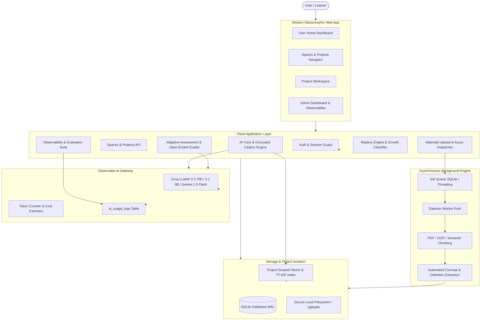
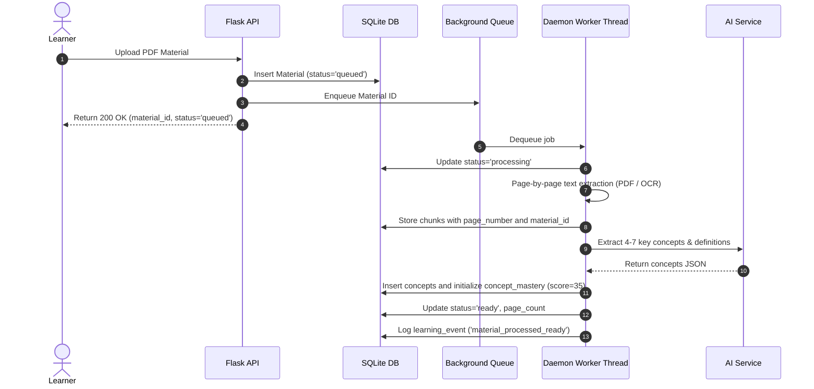
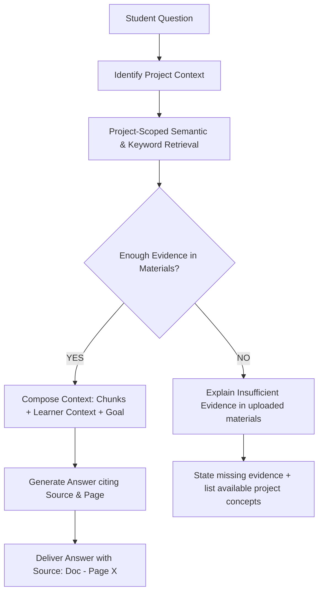

# LearnMate AI: Architecture & System Design
### **Intelligent Personalized Learning & Study Companion**

## 1. High-Level Architecture Overview

The **LearnMate AI** platform is an AI-powered learning and growth workspace designed around the principle that learning is an active, stateful, and measurable loop rather than a collection of disconnected AI features.



---

## 2. Core Structural Entities & Strict Data Isolation

```
USER
 │
 ├── SPACE (Broad learning area, e.g., "Computer Science", "Cloud Architecture")
 │    ├── PROJECT (Focused learning journey, e.g., "Virtual Memory & Paging")
 │    │    ├── Materials (PDFs, docs, notes)
 │    │    ├── Knowledge (Semantic chunks, page references, extracted concepts)
 │    │    ├── AI Tutor (Grounded chat, citations, unsupported question checks)
 │    │    ├── Quiz (Adaptive MCQ + Open-ended AI evaluation)
 │    │    ├── Mastery (0-100% estimated score per concept)
 │    │    ├── Growth (Improving, Stable, Requiring Attention)
 │    │    └── Analytics (Learning events timeline, score trends)
 │    │
 │    └── PROJECT
 └── Global Analytics
```

### Data Isolation Guarantees
- **Project-Level Context Isolation**: Retrieval queries explicitly filter `material_chunks` and `concepts` by `project_id` and authenticate against `user_id`. Chunks from other projects or other users are strictly inaccessible.
- **Persistent Learner Context**: Maintained per `(project_id, user_id)` in `learner_context`, capturing specific strengths, weaknesses, and repeated mistakes without leaking across subjects.

---

## 3. Asynchronous Background Document Processing Pipeline

Long-running file operations do not block the HTTP request thread:



---

## 4. Grounded AI Tutor & Unsupported-Question Handling

A critical requirement is evidence-grounded answering with exact citations, while avoiding fabrication when evidence is absent:



---

## 5. Adaptive Assessment & Multi-Factor Open-Ended Grader

The assessment engine does not use a simplistic `Wrong -> Easy, Correct -> Hard` rule:
1. **Adaptive Targeting**: Selects concepts with trend `requiring_attention`, lower mastery scores, or recorded repeated mistakes.
2. **Dual Question Modality**: Combines Multiple-Choice Questions (MCQ) for rapid diagnostic check and Open-Ended Questions for deep synthesis.
3. **Semantic Rubric Grading**: Open-ended answers are evaluated on:
   - Understanding & Technical Accuracy
   - Key Concepts Covered
   - Missing Concepts
   - Constructive explanatory feedback (highlighting what was understood vs what was missing)
4. **Mastery Update & Downstream Workflow**: Automatically updates concept mastery (exponential moving average), recalculates growth trajectory, and generates targeted recommendations answering *"What should I do next?"*.

---

## 6. AI Observability & Evaluation System

Every single interaction with the LLM is captured with telemetry:
- **`model`**: Model used (e.g. `llama-3.3-70b-versatile`, `llama-3.1-8b-instant`, `gemini-1.5-flash`).
- **`feature`**: Subsystem (`tutor_grounded_answer`, `tutor_unsupported_query`, `quiz_generation`, `open_ended_evaluation`, `concept_extraction`, `recommendation_generation`).
- **`latency_ms`**: Measured execution time in milliseconds.
- **`tokens`**: Prompt tokens, completion tokens, total tokens.
- **`estimated_cost_usd`**: Blended cost model per 1,000 tokens.
- **`status` / `error_message`**: Success or failure details.

### Automated Evaluation Suite
Built-in benchmark test runner executing standardized test cases for:
1. **Tutor Groundedness**: Checks for citation formatting and factual basis.
2. **Unsupported Question Rejection**: Checks that out-of-scope queries are explicitly rejected rather than hallucinated.
3. **Assessment Grading Quality**: Verifies semantic scoring against standardized student answers.
4. **Recommendation Actionability**: Verifies that generated next steps match identified student weaknesses.
