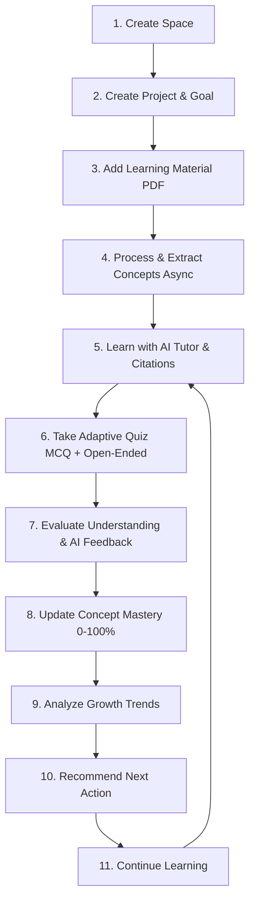

# LearnMate AI 🎓🤖
### **Intelligent Personalized Learning & Study Companion**
*Product Requirements Document Version: 3.0 — Candidate Challenge Edition*

> **LearnMate AI is an intelligent personalized learning platform that uses Artificial Intelligence, Retrieval-Augmented Generation (RAG), adaptive assessment, and learning analytics to provide students with a continuous and personalized learning experience. The system allows users to upload study materials, interact with a context-aware AI Tutor, take adaptive quizzes, track concept mastery and learning growth, and receive personalized recommendations. It also provides persistent learning context, background processing, analytics, and an administrative dashboard for monitoring platform activity and AI performance.**

LearnMate AI is a full-stack, AI-powered learning workspace designed to help users **understand, practice, measure, and continuously improve** a skill or area of knowledge. 

The core philosophy of this platform is that **learning should not be a collection of disconnected AI features**. A learner creates a learning goal, provides relevant materials, interacts with an evidence-grounded AI Tutor, tests their understanding with adaptive assessments, tracks concept mastery and growth trends, and receives actionable recommendations on what to do next.

---

## 🔄 The Primary Learning Loop

```
Create Space → Create Project → Upload Material → Process Knowledge → AI Tutor → Adaptive Quiz → Assessment → Mastery → Growth Analysis → Recommendation → Continue Learning
```




---

## 🌟 Core System Highlights

### 1. Spaces & Projects Hierarchy
- **Strict Data Isolation**: Every Space contains focused Projects, and each Project strictly isolates its learning materials, semantic chunks, conversations, quizzes, concept mastery, and activity logs.
- **Home Dashboard**: Implements the core UX triad:
  - *Where was I?* — Quick resume banner for the most recent active project.
  - *How am I doing?* — Average mastery score, concept counts (improving vs. requiring attention).
  - *What should I do next?* — Actionable AI recommendation cards with one-click triggers.

### 2. Asynchronous Document Processing Pipeline
- **Formats**: Multi-page PDFs (primary), DOCX, TXT.
- **State Machine**: `Upload` → `Queued` → `Processing / OCR` → `Content & Structure Extraction` → `Knowledge Extraction` → `Search / Retrieval Indexing` → `Ready` (or `Failed` with one-click retry).
- **Automated Concept Extraction**: Automatically analyzes documents to extract 4–7 core concepts with definitions and initializes baseline mastery levels.
- **Page Tracing**: Every chunk maintains exact `page_number` metadata for citation resolution.

### 3. Grounded AI Tutor & Unsupported-Question Handling
- **Context Composition**: Combines project materials + persistent learner context (strengths, weaknesses, repeated mistakes) + conversation history.
- **Strict Citations**: Grounded answers always provide citations formatted as:
  ```
  Source: [Document Name] — Page [X]
  ```
- **Unsupported-Question Handling (Core Evaluation Requirement)**:
  If a student asks a question for which there is insufficient evidence in the project materials (e.g. asking about baking recipes in an Operating Systems project), the Tutor **refuses to hallucinate**. It explicitly communicates that the uploaded materials lack sufficient evidence and clarifies what topics are covered.

### 4. Adaptive Assessment & Multi-Factor Open-Ended Grader
- **Adaptive Question Selection**: Selects concepts with trend `requiring_attention`, lower mastery scores, or flagged repeated mistakes.
- **Dual Question Format**:
  - **Multiple-Choice Questions (MCQ)**: Instant scoring and rubric explanations.
  - **Open-Ended Questions**: Free-text answers evaluated by AI across understanding, accuracy, relevance, key concepts covered, and missing concepts.
- **Constructive Explanatory Feedback**: Explains what was understood well versus what was missing, rather than returning only a number.

### 5. Concept Mastery, Growth & Recommendations
- **Mastery Levels**: Estimated mastery score (0% to 100%) per concept, dynamically updated via exponential moving average.
- **Growth Analysis**: Classifies concepts into:
  - 🟢 `Improving` (positive trajectory)
  - 🟡 `Stable` (consistent understanding)
  - 🔴 `Requiring Attention` (low scores or repeated mistakes)
- **Targeted Recommendations**: Answers *"What should I do next?"* (e.g., *"Take a short adaptive quiz on Demand Paging to build confidence"*).

### 6. Admin Dashboard & AI Observability
- **Platform KPIs**: Total Users, Spaces, Projects, Materials, Total AI Calls, Total Estimated Cost ($), and Average Latency (ms).
- **User Learning Journey Inspector**: Drill down into any student's projects, assessments, and AI usage history.
- **AI Observability Breakdown**: Token usage, latency, and costs grouped by feature and model.
- **Automated AI Evaluation Suite**: Built-in benchmark test harness executing standardized tests for:
  - Tutor Groundedness
  - Unsupported Question Rejection
  - Assessment Grading Quality
  - Recommendation Actionability
- **Background Jobs Queue & System Health**: Live queue inspection, retry actions, database status, and LLM provider health.

---

## 🛠️ Technology Stack

- **Backend**: Python 3.10+, Flask, SQLite (with WAL mode & foreign keys)
- **AI Gateway**: Groq SDK (LLaMA 3.3 70B & LLaMA 3.1 8B), Google Gemini SDK (Gemini 1.5 Flash)
- **Document Processing**: `pdfplumber`, `pypdf`, `python-docx`
- **NLP / Retrieval**: Scikit-Learn (TF-IDF vectorizer, cosine similarity), keyword token overlap
- **Frontend**: Glassmorphic dark UI, Lucide Icons, Marked.js (Markdown), Chart.js (Analytics)
- **Testing**: Python `unittest` suite

---

## 📁 Repository Directory Structure

```
├── app.py                     # Flask API routes and controllers
├── models.py                  # SQLite database models, schemas, and migrations
├── database.db                # Persistent database
├── services/                  # Modular backend services
│   ├── ai_service.py          # Unified AI client, token counting, cost & usage logging
│   ├── document_processor.py  # Async PDF parsing, chunking, and concept extraction
│   ├── retrieval_service.py   # Project-scoped retrieval and evidence thresholding
│   ├── tutor_service.py       # Grounded tutor with citations & unsupported question check
│   ├── assessment_service.py  # Adaptive quiz generation & open-ended AI grading
│   ├── mastery_service.py     # Concept mastery (0-100%) and growth trend calculation
│   ├── recommendation_service.py # "What should I do next?" recommendation engine
│   ├── workflow_service.py    # Event logging & post-quiz downstream workflows
│   └── evaluation_service.py  # Automated AI evaluation benchmark test runner
├── static/
│   ├── css/style.css          # Glassmorphic dark theme styling
│   └── js/app.js              # Complete frontend client logic
├── templates/
│   └── index.html             # Responsive Single-Page Application
├── tests/
│   └── test_app.py            # Automated unit and integration test suite
├── ARCHITECTURE.md            # System architecture and engineering decisions
├── AI_USAGE.md                # AI in development vs product, prompts, evaluation report
└── README.md                  # Project overview and quickstart guide
```

---

## 🚀 Quickstart & Setup Guide

### 1. Prerequisites
- Python 3.10 or higher
- A Groq API key (`gsk_...`) or Google Gemini API key

### 2. Installation
```powershell
# Clone the repository
git clone <repository_url>
cd LastMinuteAI

# Install dependencies
pip install -r requirements.txt
```

### 3. Environment Configuration
Create or update your `.env` file in the root directory:
```env
GROQ_API_KEY=your_groq_api_key_here
# Optional fallback
GEMINI_API_KEY=your_gemini_api_key_here
FLASK_SECRET_KEY=study-companion-secure-key-42
```

### 4. Initialize Database & Run the App
```powershell
# Initialize SQLite database schema
python models.py

# Start the Flask development server
python app.py
```
Open your browser and navigate to: **`http://localhost:5000`**

### 5. Default Credentials
- **Student Account**: Create any username/password via the registration screen.
- **Admin Account**: Username: `admin`, Password: `admin123` (Role: `admin`).

---

## 🧪 Running Automated Tests

Run the complete test suite verifying authentication, project isolation, mastery updates, grounded retrieval, adaptive concept selection, and admin observability:

```powershell
python -m unittest discover -s tests -p "test_*.py"
```

Expected output:
```
Ran 6 tests in ~24s
OK
```

---

## 📊 Live Evaluation Suite

Administrators can run the built-in AI benchmark evaluation suite directly from the **Admin Dashboard** tab by clicking **"Run AI Evaluation Suite"**. This programmatically tests:
1. **Groundedness**: Tests citation formatting on reference passages.
2. **Unsupported Questions**: Submits out-of-domain queries and verifies non-hallucination.
3. **Semantic Assessment**: Assesses grading against multi-point rubrics.
4. **Recommendation Actionability**: Verifies weak-concept targeting in next steps.
